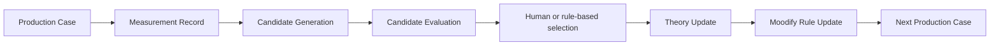

# Moodify

> 当前正式方向：v0.4 Research/Production Baseline。

Moodify 聚焦 **AI 生成音乐的后生成处理、质量分析、结构恢复和资产化**。它的目标不是自动化传统混音或廉价替代混音师，而是在限定任务上，通过可测量实验验证 WSE 分析深度、MSE 结构理解和 PPE 稳定生产相对于传统人工工作流的优势。当前没有证据支持“已经超过专业混音师”的总体结论。

## Moodify 不是什么 / 是什么

- 不是 AI 音乐生成器、一键母带、消费者 App 或自动自学习系统。
- 是面向音乐公司的本地优先研究—生产基础设施：生成候选、保存证据、由人工或受控规则选择，并把已验证经验形成版本化规则。

## 当前狭窄领域与三层架构

| 层 | 问题 | 当前状态 |
|---|---|---|
| WSE — Wave-Spectral Evolution | 声音发生了什么？ | 基础 level/spectral/stereo/residual 指标已部分实现；标准化与置信度待统一 |
| MSE — Musical-Structural Engineering | 音乐结构是什么？ | 结构 schema 已有；稳定 BPM/key/section/lyrics/MIDI 管线仍属 Planned/Experimental |
| PPE — Production Process Engineering | 怎样稳定地把它生产出来？ | Runtime/Workspace 已有；不可变 case ledger 已完成首个本地里程碑，尚待接主链 |



## 当前可以运行

- `moodify-core-package`：音频载入、基础分析、预设处理、输出、报告及 Workspace 服务；
- `moodify_runtime`：作业/队列、报告、内部 API/控制台和运行治理；
- `moodify-bridge`（Python 3.12）：不可变 Production Case、SHA-256 资产、DuckDB/Parquet/YAML 证据、规则人批、Golden Case 回归和 Markdown/HTML 报告。

快速开始（证据管线）：

```powershell
cd moodify-bridge
py -3.12 -m pip install -e ".[dev]"
py -3.12 -m moodify_bridge case create demo/case.yaml --root .demo-ledger
py -3.12 -m moodify_bridge regression run 11111111-1111-4111-8111-111111111111 demo/case.yaml --root .demo-ledger
```

## 尚未验证的研究目标

发行质量、完整结构恢复、跨曲风稳定性、相对人工优势和批量成本优势均尚未验证。缺失数据必须是 `null`/warning，不能用占位算法补齐。

## v0.4 文档入口

- [项目审计](docs/audit/PROJECT_AUDIT_2026_08.md)
- [战略定位](docs/strategy/MOODIFY_POSITIONING_v0.4.md)
- [系统架构](docs/architecture/MOODIFY_SYSTEM_ARCHITECTURE_v0.4.md)
- [Production Learning Loop](docs/architecture/PRODUCTION_LEARNING_LOOP.md)
- [90 天计划](docs/roadmap/MOODIFY_90_DAY_PLAN_2026_08_TO_2026_10.md)
- [Backlog](docs/roadmap/BACKLOG.md)
- [人类对照评价框架](docs/metrics/HUMAN_VS_MOODIFY_EVALUATION_FRAMEWORK.md)

以下内容保留为历史实现与兼容说明；如与 v0.4 文档冲突，以以上入口为准。

## Current Product Definition

> Moodify is headless music-processing infrastructure for music companies. It
> converts structured production decisions into reproducible, reviewable, and
> reusable professional audio workflows.

Moodify owns acoustic diagnosis, processing plans, candidate generation,
technical quality gates, version lineage, delivery evidence, and craft-memory
writeback. The music company owns creator communication, talent judgment,
artistic direction, final selection, signing, release, and artist operations.

The Workspace and operator console are internal validation and operations
surfaces, not a creator-facing product. The canonical scope and boundary are in
`docs/strategy/MOODIFY_MUSIC_PROCESSING_INFRASTRUCTURE.md`.

Moodify follows a permanent engineering-thickness rule: every production task
must leave a result, reproducible evidence, and inherited capability. The
cross-version standard is
`docs/strategy/MOODIFY_ENGINEERING_THICKNESS_STANDARD.md`.

Moodify is developed as long-lived industrial software, not as a consumer app.
The project works on a 2026-2046 horizon, seals one stable release per year, and
uses a sustainable four-hour daily cadence centered on one atomic task plus
verification, evidence, and inheritance. See
`docs/strategy/MOODIFY_CIVILIZATIONAL_DEVELOPMENT_MODEL.md`.

Every new AI-assisted engineering session should restore the project's tacit
engineering context before implementation. The governing protocol is
`docs/standards/MOODIFY_ENGINEERING_CONTEXT_BOOTSTRAP_PROTOCOL.md`; its
copy-paste startup command is
`docs/prompts/MOODIFY_PROJECT_STARTUP_COMMAND.txt`.

## 2026-07-26 Workspace v2 MVP

Moodify Studio Workspace v2 is sealed as `v2.0.0-mvp`. The MVP provides the
project, brief, workflow-thread, treatment-plan, version, Judge, human approval,
and final-archive loop. The operator API includes the eight-view internal
console shell required by the runtime.

Primary validation commands:

```powershell
python -m pytest moodify-core-package/tests -q
python -m pytest moodify_runtime/tests -q
```

The older v0.1/v0.2 status sections below are retained as architecture history.

## 2026-06-04 Direction Update

Moodify is now directed as an enterprise acoustic industrial system, not a consumer one-click music app.

Working definition:

> Moodify is not a button. Moodify is a machine.

The product should be built around an internal operator console, job queue, deep acoustic scans, cloud/runtime processing, candidate versions, MRS quality gates, reports, delivery records, and craft-library accumulation.

Read the active direction documents first:

- `docs/strategy/MOODIFY_INDUSTRIAL_DIRECTION.md`
- `docs/plan/MHP-031_INTERNAL_OPERATOR_CONSOLE.md`

AI 音乐二次处理与情绪声波工程系统。

Moodify 的目标不是再次生成音乐，而是对 AI 生成音乐进行二次处理、频谱诊断、DSP 工艺修正、听感校准和经验沉淀。

```text
AI 生成原声
  ↓
频谱分析
  ↓
声音诊断
  ↓
DSP 预设处理
  ↓
导出优化 WAV
  ↓
Before / After 检查
  ↓
人工听感反馈
  ↓
Treatment Records
  ↓
工艺参数沉淀
```

---

## Status

* **Current Version**: `v0.2.0-alpha` (NEM-18 complete — first NEM node: Studio OS Alpha)
* **Current Engineering State**: `Harden-6 complete — Gate: ADOPT`
* **Protocol**: NEM-18 = Build-6 + Validate-6 + Harden-6
* **Mainline**: `codex/mainline-cloud-dev-20260603`
* **Core Mode**: Industrial-system-first / runtime-first / report-first
* **Strategic Direction**: enterprise acoustic industrial system
* **CLI**: 40+ subcommands via `moodify_runtime.cli`
* **API**: 48 FastAPI routes via `moodify_runtime.operator_api`
* **Console**: 8 views (Queue, Jobs, Reports, Delivery, Craft, Studio, Scheduler, Calibration)
* **Tests**: 719 passing locally (607 runtime + 112 core)
* **Pass Rate**: 100% on the current mainline branch
* **X-CLP Score**: ~30 (Script tier) → target ≥60 next cycle

---

## What Moodify Does

Moodify v0.1.0 focuses on one minimal, stable product loop:

```text
导入音频 → 频谱分析 → 诊断报告 → DSP 预设处理 → 导出优化 WAV
```

Current v01 capabilities:

1. Load WAV / MP3 / FLAC audio.
2. Analyze spectrum and core audio metrics.
3. Generate a rule-based diagnosis report.
4. Apply one of three DSP presets.
5. Export processed audio as WAV.
6. Inspect before / after differences.
7. Record treatment results.
8. Add human listening feedback.
9. Aggregate experience records.

---

## Core Product Philosophy

Moodify is built around one long-term idea:

> AI 音乐的真正机会，不只在生成，而在后期工艺。

Current AI music generators can create songs quickly, but many generated tracks still have problems such as:

* flat spectrum
* weak transient impact
* thin vocal texture
* artificial high-frequency brightness
* pasted-on spatial image
* limited emotional dynamics
* plastic / synthetic feel

Moodify treats AI music as raw material.

The purpose of Moodify is to turn generated audio into more finished, more listenable, more emotionally convincing music through repeatable sound engineering workflows.

---

## Install

```bash
cd moodify-core-package
pip install -e .
```

Requires Python 3.10+.

---

## CLI Quickstart

### List Presets

```bash
moodify presets
```

### Analyze Audio

```bash
moodify analyze song.wav
```

Expected output:

```text
outputs/song_spectrum.png
```

### Process Audio

```bash
moodify process song.wav --preset warm_vocal
```

Expected output:

```text
outputs/song_warm_vocal.wav
outputs/song_warm_vocal_report.json
```

---

## Current Presets

| Preset         | Name | Description       |
| -------------- | ---- | ----------------- |
| `warm_vocal`   | 温暖人声 | 增强人声温度、厚度和亲密感     |
| `clean_master` | 干净母带 | 透明母带处理，清理频谱，增强稳定性 |
| `wide_space`   | 宽阔空间 | 增强空间感和听觉宽度        |

Each preset currently maps to 15 DSP parameters:

```text
P01-P03  Vocal presence
P04-P05  Low warmth / proximity
P06-P09  Compression
P10-P12  Reverb / space
P13      Harmonic drive
P14-P15  High shelf / air
```

---

## v01 Mainline Architecture

The v01 mainline is deliberately small.

```text
v01_types.py          — AudioMetrics / DiagnosisReport / ProcessResult
v01_presets.py        — 3 presets × 15 DSP params
v01_analyzer.py       — FFT spectrum → AudioMetrics + PNG
v01_diagnostics.py    — rule-based DiagnosisReport
v01_exporter.py       — 16-bit WAV + peak clamp
v01_pipeline.py       — import → analyze → diagnose → process → export
```

The core orchestration is:

```text
process_audio(input_path, preset, output_dir)
  ↓
analyze(input_path)
  ↓
diagnose(metrics)
  ↓
MoodifyDSPChain(preset_params).process(audio)
  ↓
export(processed_audio)
  ↓
save diagnosis report
```

---

## Local Experience Loop

Moodify v0.1.0-alpha.3 includes a local experience loop.

```text
process audio
  ↓
inspect before / after
  ↓
calibrate presets
  ↓
create treatment record
  ↓
write human feedback
  ↓
aggregate records
```

Current local tools:

```text
scripts/v01_inspector.py
scripts/v01_calibrate_presets.py
scripts/v01_create_treatment_record.py
scripts/v01_update_treatment_feedback.py
scripts/v01_aggregate_treatment_records.py
```

These tools are not just utilities.

They are the beginning of Moodify’s engineering memory.

---

## Current Treatment Record State

Current MHP-024 state:

```text
Total records:        9
Presets:              warm_vocal, clean_master, wide_space
Completed feedback:   3
Pending feedback:     6
Feedback coverage:    33%
Global better rate:   3/3 yes
```

Current sample coverage:

```text
electronic_001
piano_001
vocal_folk_001
```

Current preset feedback state:

| Preset         | Records | Completed Feedback | Better Yes |
| -------------- | ------: | -----------------: | ---------: |
| `warm_vocal`   |       3 |                  1 |          1 |
| `clean_master` |       3 |                  1 |          1 |
| `wide_space`   |       3 |                  1 |          1 |

Important interpretation:

The current feedback is directionally positive, but still too small to prove stability.

Moodify should not treat 3 completed feedback records as product-level validation.

---

## Important Listening Rule

Current treatment records show strong RMS increases after processing.

That means listening tests must avoid the common bias:

```text
louder = better
```

For formal A/B comparison, use matched-loudness output from the Inspector workflow.

Do not judge preset quality only from the louder processed file.

Recommended listening protocol:

```text
Original audio
  vs
Processed audio with matched loudness
```

Human feedback should be written only after matched-loudness comparison whenever possible.

---

## API Status

The API exists, but it is not yet fully aligned with the v01 mainline.

Current target architecture:

```text
POST /process
  ↓
v01_pipeline.process_audio()
  ↓
preset-based processing
```

Current known mismatch:

```text
README target: /process should use v01_pipeline
Current implementation: /process still calls legacy WorkflowOrchestrator
Current API parameter: emotion
Expected v01 parameter: preset
```

Before any frontend, desktop app, or user-facing integration, the API should be migrated to v01.

Required API alignment tasks:

```text
GET  /health
GET  /presets
POST /process      # audio + preset
```

Expected `/process` behavior:

```text
Input:
  audio file
  preset = warm_vocal | clean_master | wide_space

Output:
  processed WAV
  diagnosis report metadata
```

---

## Legacy System

The old system is preserved, but it is not the v0.1.0 mainline.

Legacy modules include:

```text
diagnosis/       — 18-param DiagnosisEngine + defect classifier + health scorer
orchestration/   — 6-phase WorkflowOrchestrator
knowledge/       — emotion targets + craft chains
processing/      — pedalboard DSP chain + spectral operators
evaluation/      — batch AI evaluation
calibration/     — online D-value calibration
physics/         — B-matrix experiments
llm/             — DeepSeek client + RAG prompts
optimizer/       — 5D strength space search
safety/          — parameter projection + bounds
memory/          — SQLite + JSONL history
```

Legacy CLI commands:

```bash
moodify legacy-analyze <file>
moodify legacy-process <file> <emotion>
```

The legacy system should not be deleted.

But it should not be reconnected to the v01 `/process` path during the v0.1.x phase.

---

## Development Rules

Do:

* Treat Moodify as an industrial system, not a consumer one-click app.
* Build around jobs, queues, reports, gate decisions, delivery records, and craft-library writeback.
* Keep v01 small and stable.
* Add tests when changing the pipeline.
* Preserve treatment records.
* Use matched-loudness A/B listening.
* Treat human feedback as engineering data.
* Build from simple rules before introducing models.
* Keep generated heavy assets out of Git.

Do not:

* Do not make casual C-end onboarding the next product center.
* Do not make instant one-click processing the core interaction.
* Do not delete legacy systems.
* Do not reconnect `WorkflowOrchestrator` to the v01 mainline.
* Do not expand presets too early.
* Do not build a consumer GUI in v0.1.x; the next UI is the internal operator console.
* Do not start cloud/database/model training in v0.1.x.
* Do not call current feedback statistically conclusive.
* Do not judge processed audio without loudness matching.

---

## Data and Git Policy

Moodify generates two classes of data.

### Commit to Git

Lightweight project memory:

```text
treatment_records/*.json
treatment_records/summary.json
treatment_records/summary.md
docs/
scripts/
src/
tests/
```

### Do Not Commit

Heavy generated assets:

```text
calibration_reports/
inspector_reports/
listening_test/
*.wav
*.flac
*.mp3
*.png
*.html
*.bak
```

Exception:

```text
tests/baseline/test_audio/*.wav
```

Baseline test audio may be committed if it is required for automated tests.

---

## Tests

Run v01 tests:

```bash
pytest -m v01
```

Run full test suite:

```bash
# Runtime tests
python3 -m pytest moodify_runtime/tests/ -q

# Core package tests
python3 -m pytest moodify-core-package/tests -q
```

Current reported status:

```text
607 runtime tests passed, 9 skipped
112 core package tests passed
719 total passing tests on codex/mainline-cloud-dev-20260603
```

### Mainline Node Status

| Node | ID | Status | Gate | Tests |
|------|-----|--------|------|-------|
| Studio OS Alpha | NEM-MOODIFY-STUDIO-OS-001 | COMPLETE | ADOPT | covered |
| MRS / Runtime / Craft / Tidal expansion | E-Chain 001-012 workstream | IMPLEMENTED ON MAINLINE BRANCH | verify before release | 719 green |
| Next | Documentation/state reconciliation and main merge | active | — | — |

See `docs/nem/NEM-MOODIFY-STUDIO-OS-001.md` and `PROJECT_ROADMAP.md`.

Known test gap:

```text
CLI/API smoke tests are still mostly manual.
Real audio regression tests should be expanded.
```

---

## Known Issues

Current known issues:

1. API `/process` still needs migration from legacy `WorkflowOrchestrator` to `v01_pipeline`.
2. API parameter should change from `emotion` to `preset` for the v01 path.
3. `/presets` API endpoint should be added.
4. Current feedback coverage is only 33%.
5. Treatment records show strong loudness increase, so matched-loudness evaluation is required.
6. Real audio regression coverage is still limited.
7. Rule-based diagnosis is intentionally simple and should not be treated as final audio intelligence.

---

## Next Milestones

### MHP-031 Internal Operator Console

Goal:

```text
Make the next product surface an internal industrial operator console.
```

Tasks:

```text
- Define durable Job / Candidate / Score / Gate / Report / Delivery records
- Create or align queue storage for internal jobs
- Attach runtime/MRS evidence to report bundles
- Build the first console view around queue and job detail
- Promote reports and gate decisions into the main workflow
- Keep heavy audio outputs out of Git
```

Reference:

```text
docs/plan/MHP-031_INTERNAL_OPERATOR_CONSOLE.md
```

### MHP-025 — API v01 Alignment

Goal:

```text
Make API match the v01 CLI mainline.
```

Tasks:

```text
- Add GET /presets
- Change POST /process to accept preset
- Route POST /process through v01_pipeline.process_audio()
- Return processed WAV
- Include diagnosis metadata
- Add API smoke tests
```

### MHP-026 — More Treatment Records

Goal:

```text
Increase feedback reliability.
```

Target:

```text
30 treatment records
10 records per preset
at least 10 completed human feedback entries
```

Sample types to include:

```text
AI vocal
Suno pop
electronic
piano
folk vocal
rock
ambient
rap / spoken vocal
dense mix
thin demo
```

### MHP-027 — Rule-Based Adaptive Preset Prototype

Goal:

```text
Use diagnosis metrics + treatment history to suggest preset and light parameter adjustments.
```

Important constraint:

```text
This is not a trained model.
This is a rule-based adaptive prototype.
```

Possible inputs:

```text
rms_bass
rms_presence
rms_air
crest_factor
dynamic_range_db
correlation_lr
human feedback summary
```

Possible output:

```text
recommended_preset
parameter_adjustments
risk_warning
matched-loudness instruction
```

---

## Project Direction

Moodify’s long-term path:

```text
Prompt
  ↓
Production
  ↓
System
```

Meaning:

```text
Prompt      = generate music
Production  = make generated music listenable
System      = turn sound treatment into repeatable engineering memory
```

Moodify should not compete only as another AI music generator.

Moodify should become the post-processing layer for AI music.

Its long-term moat is not only code.

Its moat is:

```text
code
+ DSP chain
+ presets
+ listening records
+ treatment history
+ feedback aggregation
+ parameter calibration
+ audio engineering taste
+ long-term experiment time
```

---

## License

Moodify uses the GNU General Public License v3.0. See [LICENSE](LICENSE).

Unless stated otherwise, source code and documentation in this repository are licensed under `GPL-3.0-only`. Input audio, generated audio, third-party models, third-party datasets, and external media remain under their own rights and license terms.

Repository:

```text
https://github.com/huliye24/moodify-ai
```
