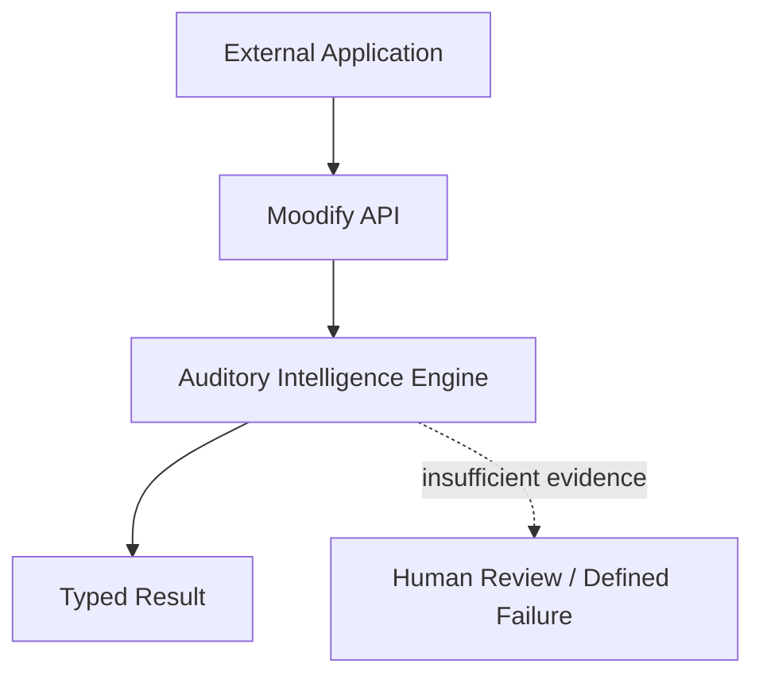

# Moodify API Design

**Status:** Experimental integration architecture

**Scope:** Repository API boundary and future service direction. This document does not claim a publicly deployed API, cloud inference, customer integration, or a change to Moodify Music / Player’s public product identity.

## Purpose

The Moodify API boundary separates external application contracts from auditory-intelligence implementation details. It enables callers to request analysis or a scoped evaluation while keeping core algorithms, processing decisions, and operational placement replaceable.



## Current Facade

The experimental facade is implemented in `moodify-core-package/src/moodify/api/` under `/api/v1/intelligence`:

- `/analyze` adapts a bounded upload to the existing v0.1 analysis engine.
- `/evaluate` returns an experimental MRS result only when the caller supplies the normalized MRS feature contract; otherwise it returns `FEATURES_REQUIRED`.
- `/process` deliberately returns `501 NOT_IMPLEMENTED` and does not select a DSP pipeline.

The earlier `/api/v1/auditory` routes remain separate and unchanged.

## Layering

```text
Route: HTTP multipart parsing, response codes, and request metadata
    ↓
Service: upload lifecycle and orchestration of core calls
    ↓
Core: analysis implementation and experimental MRS contracts
```

This separation allows future workers, GPU execution, model serving, queueing, and storage adapters to be introduced without embedding infrastructure concerns in core audio algorithms.

## Future Readiness Requirements

Before this boundary can become an industry-facing service, it requires:

- authentication, authorization, tenancy, and rate limits;
- durable object storage and deletion/retention policy;
- asynchronous job contracts for expensive processing;
- observability, failure taxonomy, and operational runbooks;
- versioned MRS benchmark evidence and human-evaluation governance;
- deployment verification for every advertised capability.

Until these conditions are met, the API is a repository-level framework rather than a production service.
