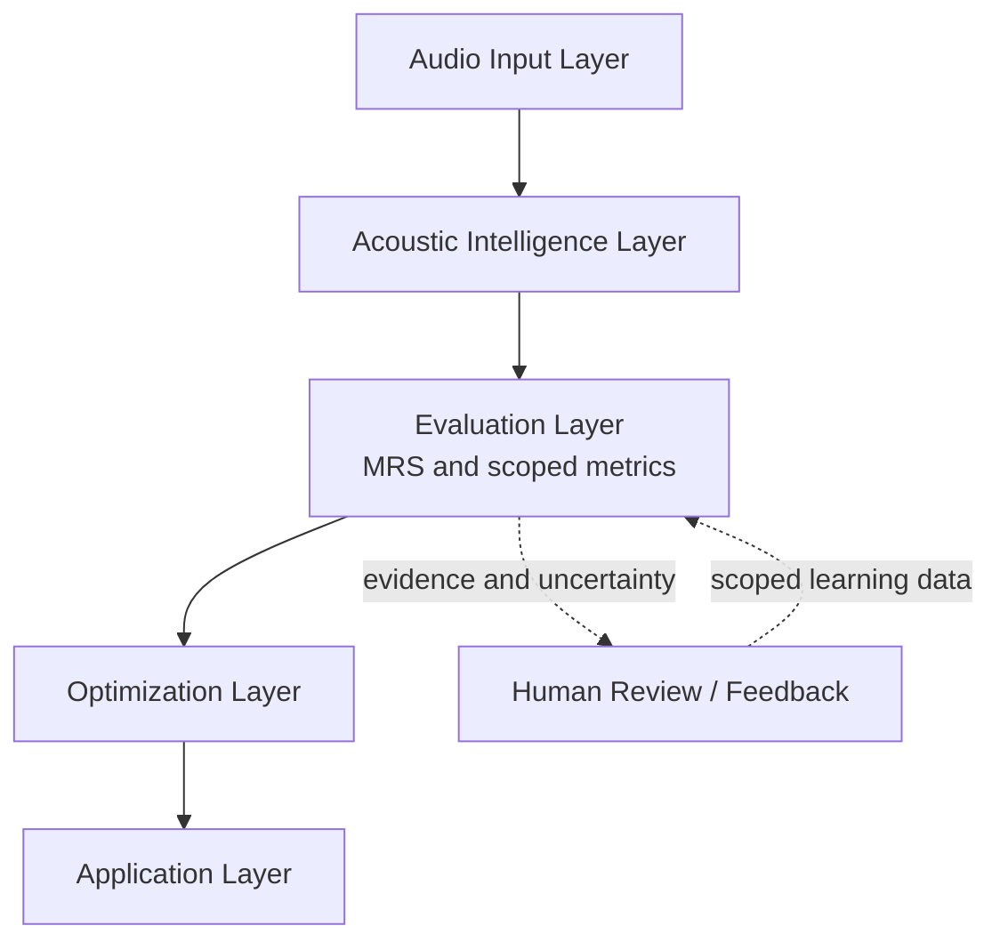

# Moodify Architecture

**Document status:** Technical architecture overview

**Scope:** Repository architecture and intended evolution; not a deployment claim or a second public-product definition.
**Canonical context:** [Current Canon](canon/CURRENT_CANON.md) · [Product Boundary](canon/PRODUCT_BOUNDARY.md) · [Repository Status](REPOSITORY_STATUS.md)

Moodify is designed as an auditory intelligence infrastructure: a technical system for representing, evaluating, and making bounded improvements to audio. In the AI era, generation capability alone is insufficient; systems also need ways to measure sound, assess explicitly defined listening-relevant properties, retain evidence, and escalate uncertainty to human judgment.

The current repository is a research prototype with implemented analysis, diagnosis, controlled DSP intervention, and evidence-oriented data workflows. The target architecture below describes its direction. It does not assert that every layer is deployed, model-backed, or production-ready.

## Layer 1: Audio Input Layer

**Responsibility:** accept or locate audio, decode supported formats, and establish the metadata required by downstream processing.

Current repository capabilities include audio loading through `soundfile` with a `librosa` fallback, plus FFmpeg/FFprobe-based decode and probing paths in selected subsystems. The layer is responsible for preserving source identity, sample rate, channels, and decoding failures as explicit inputs to subsequent work.

This layer does not imply that arbitrary user uploads are accepted by a deployed public service.

## Layer 2: Acoustic Intelligence Layer

**Responsibility:** produce inspectable acoustic observations rather than opaque quality claims.

Current analysis and diagnostic paths include:

- loudness and level-related measurements;
- wave and spectral analysis;
- dynamic-range-related measurements;
- stereo correlation and other spatial proxies;
- acoustic feature extraction used by diagnosis and evaluation components.

These observations provide evidence for downstream decisions. They are not a complete representation of musical meaning, emotion, or listener preference.

## Layer 3: Evaluation Layer

**Core research component:** Moodify Reality Score (MRS).

The repository includes reference-based MRS computation and before/after comparison utilities. MRS currently expresses a configured distance from reference feature statistics; it is an evaluation framework for scoped research use, not a validated universal measure of audio quality or human enjoyment.

The evaluation layer is responsible for:

- producing auditable metric results;
- connecting observations to bounded diagnosis or processing feedback;
- recording uncertainty, evidence, and cases requiring human review.

## Layer 4: Optimization Layer

**Current implementation:** diagnosis-driven, rule-based DSP through the processing pipeline and Pedalboard chain.

**Future direction:** AI-guided processing, adaptive mastering, and personalized listening may be investigated only after task-specific validation, safety boundaries, and comparison protocols exist. These capabilities are not represented here as current production services.

Optimization is controlled intervention: a no-change or bypass result remains valid when evidence does not justify processing.

## Layer 5: Application Layer

The repository contains product-facing Android and web-player surfaces, API-oriented Python components, and operational/data-factory modules. The current public product remains Moodify Music / Moodify Player, centered on playback.

Potential future integration surfaces include creator tools, enterprise APIs, and music-industry workflows. They are roadmap directions, not presently offered platform commitments.

## Architecture Principles

- **Evidence before intervention:** analysis and evaluation should precede processing decisions.
- **Scoped authority:** automated decisions are valid only within defined, versioned, and tested conditions.
- **Human escalation:** insufficient evidence, uncertainty, and unresolved perception cases require `HUMAN_REQUIRED`, `INCONCLUSIVE`, or another defined failure state.
- **Reproducibility:** measurements, processing parameters, and evidence artifacts should make a case reviewable.
- **Separation of fact and direction:** repository code and validated runtime evidence define present capability; roadmap language describes future work.
