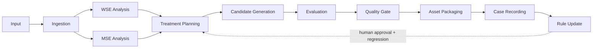

# Moodify 系统架构 v0.4

状态：Target architecture；已实现状态以 `PROJECT_AUDIT_2026_08.md` 为准。

## 模块职责与接口

| 模块 | 输入 | 输出 | 职责 | 状态/实现位置 |
|---|---|---|---|---|
| Ingestion | 本地资产路径、权利/角色元数据 | SHA-256 SourceAsset | 只读核验、解码预检、case 分配 | Partially implemented：core audio_io、bridge hashing |
| WSE | 音频与采样率 | MeasurementRecord | 波谱/动态/相位/声道/残差与置信度 | Partially implemented：core analyzer/features、bridge metrics |
| MSE | 音频及可选 MIDI/歌词/曲谱 | StructuralRecord | 节拍、调性、段落、乐句、旋律、歌词、角色 | Planned/Experimental |
| Treatment Planning | WSE/MSE、规则版本、限制 | 版本化计划/阶段参数 | 人与规则生成可审查处理方案 | Partially implemented：v01 preset、Workspace plan |
| Candidate Generation | 源资产、计划、pipeline | CandidateRecord + 音频 | 生成不覆盖的候选 | Experimental/partial |
| Evaluation | before/after/结构/人工观察 | EvaluationRecord | 分离技术、结构、感知与生产评价 | Partially implemented |
| Quality Gate | evaluations、rule versions | pass/warn/fail | 阻止无证据候选进入交付 | Partially implemented，多套定义待统一 |
| Asset Packaging | 被批准候选与结构/报告资产 | DeliverableManifest | 内容寻址、封装、权利与缺失检查 | Partial |
| Case Recording | 全部对象与事件 | append-only ledger | 不可变事实、revision、失败/回滚 | `moodify-bridge` partial |
| Rule Update | theory note、validation、approval | 新 RuleRecord | 只提议；人批+Golden回归后发布 | bridge partial |

## 数据流与控制流

数据流是 append-only：源资产永不被处理器原地修改；候选获得新哈希；测量表写 Parquet；对象元数据写 DuckDB；规则/假设写 YAML。控制流由 PPE 驱动，WSE/MSE 只产生带版本和置信度的证据。自动 gate 可拒绝或警告，但规则晋级和最终艺术选择必须有明确责任记录。

## 依赖方向

`common/schemas/assets` 不依赖研究或处理模块；WSE/MSE 依赖 ingestion/common；treatments 只消费 schema；candidate_generation 依赖 treatments；evaluation 消费候选与测量；PPE/quality_gates 编排但不得反向改变原始测量；reporting 只读。

## 研究、实验与生产边界

- **Production-ready：** 只有通过固定依赖、回归、错误处理、版本记录和运行手册的代码。
- **Partially implemented：** 可运行但尚未通过完整真实案例/标准后端验证。
- **Experimental：** `experiments/`、legacy optimizer、MSE 原型；输出不得直接进入 production rule。
- **Planned：** 完整 masking、section evolution、歌词对齐、MIDI/曲谱恢复、统一候选注册和 A/B/C benchmark。

## 兼容策略

本轮不移动 `moodify-core-package` 或 `moodify_runtime`。`moodify-bridge` 先作为 contract/ledger 兼容层；主链以 adapter 写入 case ID、pipeline version、rule versions 与资产哈希。逐模块迁移必须先有回归测试。

