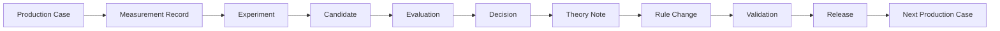

# Production Learning Loop

## 标识与版本

建议外部 ID：`CASE-YYYYMMDD-XXXX`、`EXP-YYYYMMDD-XXXX`、`CAND-CASEID-XX`、`RULE-WSE-XXX-vX.Y`、`RULE-MSE-XXX-vX.Y`、`PIPELINE-vX.Y.Z`、`REPORT-CASEID-vX`。现有 bridge UUID 继续作为不可变内部主键；外部 ID 是带唯一约束的可读键，迁移期不替换 UUID。

| 层 | 数据对象 | 必需关联 | 版本规则 |
|---|---|---|---|
| Case | ProductionCase | source assets, pipeline, rules | 初始快照不可改；revision append |
| Measurement | MeasurementRecord | case, asset, adapter | 算法/参数/backend 变化即新版本 |
| Experiment | ExperimentRecord | case, hypothesis, controls | 预注册变量和停止条件 |
| Candidate | CandidateRecord | experiment, parent asset, stages | 内容哈希唯一；不覆盖 |
| Evaluation | EvaluationRecord | candidate(s), evaluator/gate | 区分 technical/structural/perceptual/production |
| Decision | DecisionRecord | evaluations, selected candidate | 人工责任或明确 rule version |
| Theory | ResearchHypothesis/Theory Note | decisions/evidence | 不把相关性写因果 |
| Rule | RuleRecord | theory, evidence, validation, approval | 生命周期单向受控；production 必须人批 |
| Validation | ValidationResult | rule/pipeline + Golden Set | 失败阻止 release |
| Release | DeliverableManifest | selected candidate/reports/assets | manifest 版本与哈希冻结 |

关系原则：一个 Case 可有多个 Experiment；一个 Experiment 可有多个 Candidate；Evaluation 不改变 Candidate；Decision 只能选择已登记候选；Rule Change 必须引用 Theory Note 和 EvidencePacket；Release 必须引用通过的 ValidationResult 与 HumanApproval。

