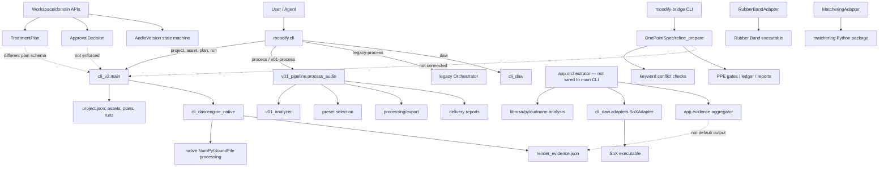

# Codex Reconstruction of Moodify's Current Architecture

**Audit date:** 2026-08-01  
**Scope:** current working tree, including uncommitted and untracked code  
**Important:** this is the observed architecture, not the target architecture.

## Actual runtime surfaces

## Responsibilities and observed dependency direction

| Area | Current responsibility | Actual condition |
|---|---|---|
| Entry points | Legacy CLI, CLI v2 dispatch, Bridge CLI, Runtime/operator APIs | Multiple competing control surfaces |
| Specification | `moodify_bridge.schemas.OnePointSpec` | Strict locally; not canonical across core execution |
| Analysis | v0.1 analyzer, science package, `app.orchestrator.analyze_audio` | Duplicated and not joined to one case lifecycle |
| Planning | CLI-v2 gain plan, domain `TreatmentPlan`, app dataclass plan | Three incompatible models |
| Approval | Domain `ApprovalDecision`, Bridge rule approval | Real objects, but absent from CLI-v2/audio apply gate |
| Execution | Native renderer, v0.1 processing, SoX/Matchering/Rubber Band adapters | Replaceability is partial and semantics differ |
| Verification | CLI-v2 hash verification, v0.1 quality gate, spectral evidence | Separate results; execution can be `completed` first |
| Evidence | render JSON, delivery artifacts, Bridge PPE, spectral package, aggregate JSON | No mandatory self-contained production-case bundle |
| Storage | `project.json`, Bridge ledger/DuckDB/YAML, workspace objects | No shared registry or immutable case identity |
| Configuration | CLI arguments, package defaults, adapter discovery | No approved environment/engine lock |
| Tests | Core, CLI-v2, v0.1, Bridge, runtime suites | Key domain tests fail collection in current environment |

## Hidden or bypass state transitions

1. `moodify process input.wav` goes directly through analysis, preset selection, processing and delivery without `OnePointSpec` or approval.
2. `moodify plan create` creates an executable plan containing only `intent`, `steps`, `dry_run` and warnings.
3. `moodify run execute` checks only plan existence, non-dry status, output nonexistence and source hash. It does not check approval, constraints, plan version or engine version.
4. A successful renderer immediately stores and returns `status=completed`; `run verify` is a later optional command.
5. `app.orchestrator.execute_plan` is a second direct execution bypass with no approval gate and no source-hash recheck.
6. `app.evidence.aggregate_evidence` can write a bundle with no evidence sources and only a limitation string.

## Mixed responsibilities and direct calls

- Product intent is mixed with engine parameters in CLI-v2 (`gain_db` becomes a native node directly).
- `app.orchestrator` both makes policy suggestions and selects SoX.
- Adapter evidence dataclasses are duplicated across adapters instead of using one protocol.
- SoX adapter treats an unknown action as an empty effect list rather than rejecting it before execution.
- Engine discovery is local to adapters; version identity is not bound to an approved plan.

## Target-layer comparison

| Target layer | State | Reason |
|---|---|---|
| CLI/API/Agent interface | Partial | Structured CLI v2 exists; lifecycle commands are incomplete |
| Production case/state | Partial/mixed | Core project, Bridge case and Workspace versions compete |
| Identity/intent specification | Partial | Strong Bridge schema, bypassable by core execution |
| Analysis/diagnosis | Exists/mixed | Several analyzers with no canonical output |
| Planning/conflict checks | Partial/mixed | Conflict checks are not in executable plan path |
| Dry-run/human approval | Contradicted | Dry-run blocks apply, but executable plans need no approval |
| Replaceable engines | Partial | Interfaces/adapters exist; semantics/evidence are not stable |
| Verification/comparison | Partial | Hash checks work; verification is optional and narrow |
| Evidence package/registry | Partial | Multiple evidence formats, no mandatory linked bundle |

## Source references

- `moodify-core-package/src/moodify/cli.py`
- `moodify-core-package/src/moodify/cli_v2/main.py`
- `moodify-core-package/src/moodify/v01_pipeline.py`
- `moodify-core-package/src/moodify/cli_daw/engine_native.py`
- `moodify-core-package/src/moodify/app/orchestrator.py`
- `moodify-core-package/src/moodify/app/evidence.py`
- `moodify-core-package/src/moodify/domain/approval.py`
- `moodify-core-package/src/moodify/domain/audio_version.py`
- `moodify-core-package/src/moodify/domain/treatment_plan.py`
- `moodify-bridge/src/moodify_bridge/schemas.py`
- `moodify-bridge/src/moodify_bridge/services.py`
