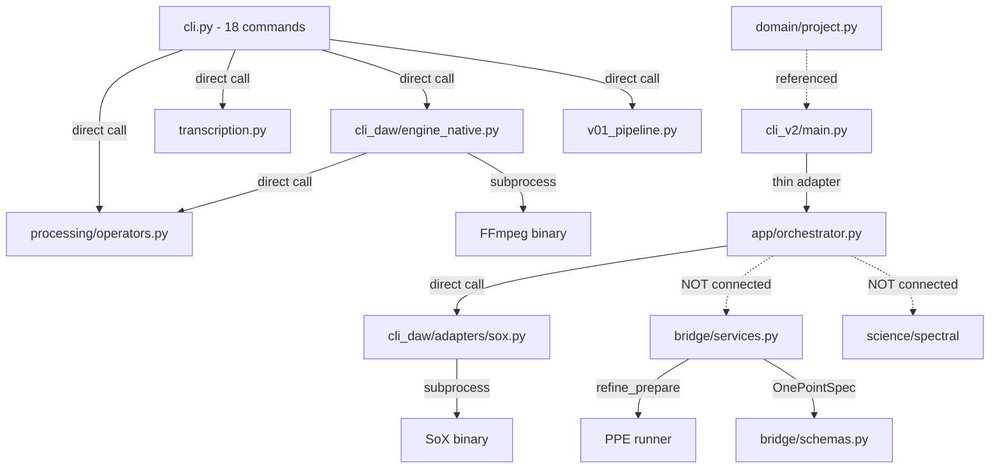

# Moodify Current Architecture (as-is, not target)

**Date:** 2026-08-01

## Dependency Flow (actual, runtime)

## Critical Bypass Paths

1. **CLI → DSP:** `moodify process` calls DSP directly. No OnePointSpec. No must_preserve.
2. **CLI DAW → NativeDSP:** `moodify daw render` accepts raw WAV. No spec layer.
3. **app.orchestrator → SoX:** `execute_plan()` has no approval gate.
4. **Bridge vs App:** Two separate orchestrator systems with zero connection.

## Mixed Responsibilities

- `cli.py`: routing, argument parsing, and business logic (600+ lines)
- `app/orchestrator.py`: analysis, planning, AND execution (should be 3 layers)
- `bridge/services.py`: PPE runner, gate evaluation, lyrics processing, refine orchestration

## Module Count

- Core DSP: 11 modules
- Bridge: 9 modules
- CLI DAW: 9 modules
- Domain: 7 modules
- App: 3 modules
- Transcription: 6 modules
- Other: 50+ modules
- **Total:** ~100 Python files
