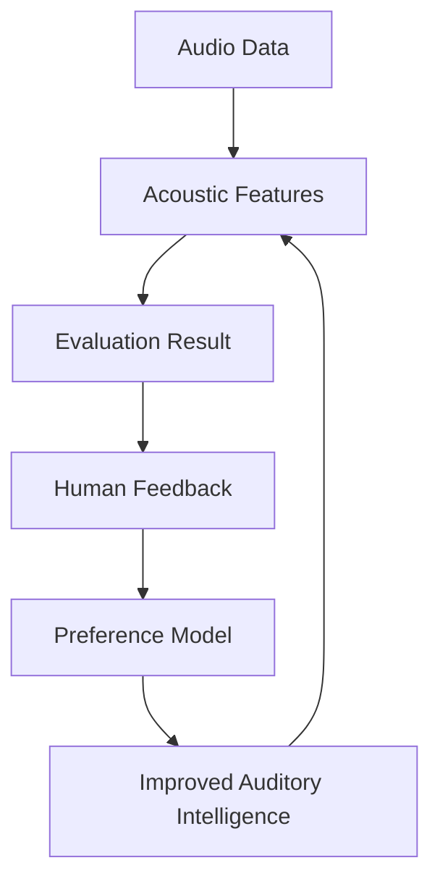

# Moodify Data Flow

**Document status:** Current-flow summary and future closed-loop direction

**Scope:** This document does not claim an existing preference dataset, trained preference model, or production learning service.

Moodify treats audio work as an evidence-bearing flow. The current repository supports portions of the path through audio analysis, diagnosis, controlled intervention, data-factory records, and algorithmic review. Human-feedback and preference-learning components remain experimental or future work.

## Target Learning Loop

## Flow Stages

### 1. Audio Data

An audio source enters through an ingest or decode path. Source metadata, format properties, and processing identity should remain associated with the case where available.

### 2. Acoustic Features

Analysis derives measurable observations such as loudness-related values, spectral characteristics, dynamic-range-related values, and stereo/spatial proxies. These features are not equivalent to listener preference; they are evidence used for specific evaluation tasks.

### 3. Evaluation Result

Evaluation produces a metric result, diagnosis, comparison, or evidence record. The current MRS utilities are reference-based and configurable. A result must retain its reference context and weights to remain interpretable.

### 4. Human Feedback

Human review can supply listening judgments, corrections, and exception handling. Existing treatment-record feedback fields are experimental; no data scale, label coverage, or preference agreement level is asserted here.

### 5. Preference Model

A future preference model would be trained only from consented, well-defined, versioned feedback and benchmark data. Its task, population, error modes, and uncertainty behavior would require explicit validation before it could influence an automated decision.

### 6. Improved Auditory Intelligence

Validated learning may improve representations, evaluation criteria, or recommendation policies. It must not silently replace human judgment outside its validated scope.

## Data Governance Requirements

- Do not commit private audio, credentials, or unlicensed datasets.
- Keep source, feature schema, metric version, and processing configuration traceable.
- Separate experimental records from verified production evidence.
- Preserve human reviewer, scope, time, and supporting evidence for decisions that require human authority.
- Treat absence of feedback as absence of evidence, not as positive preference.
