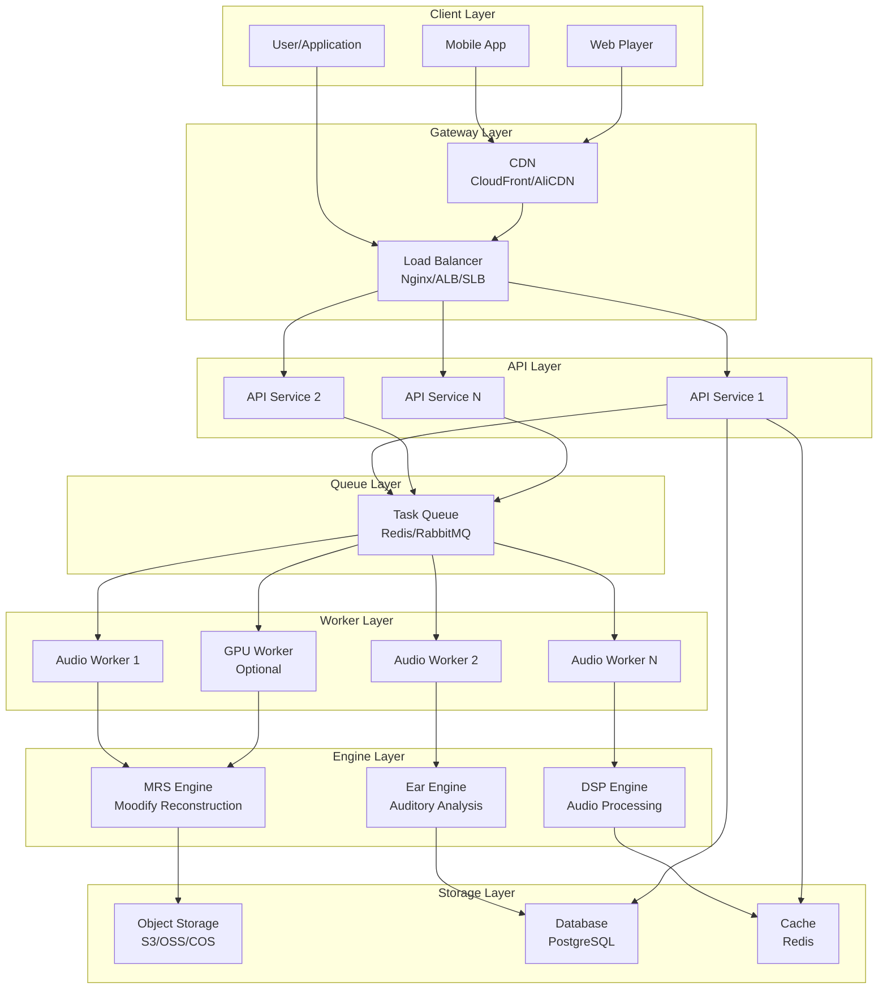
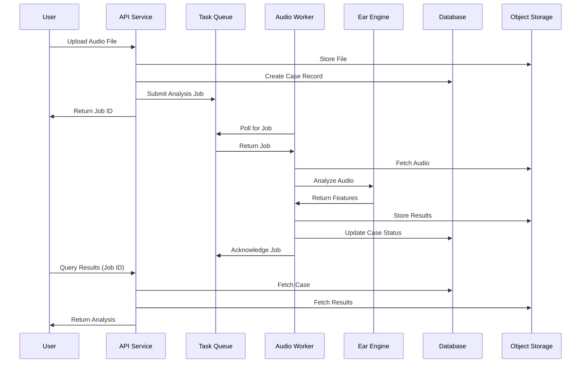
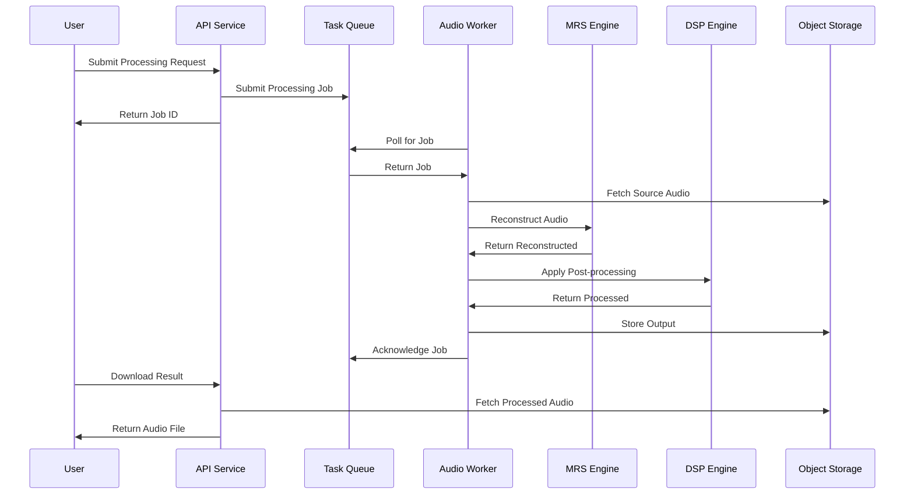
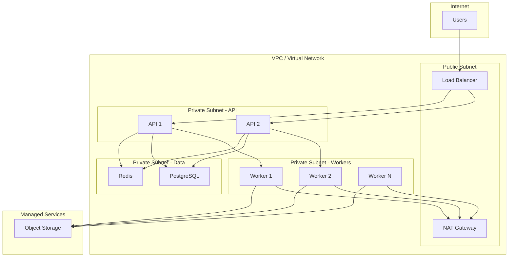
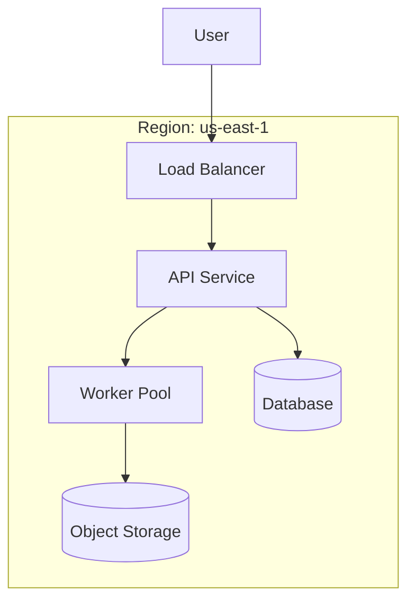
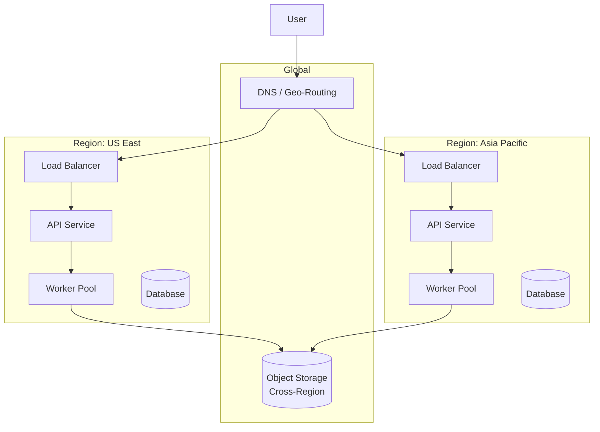
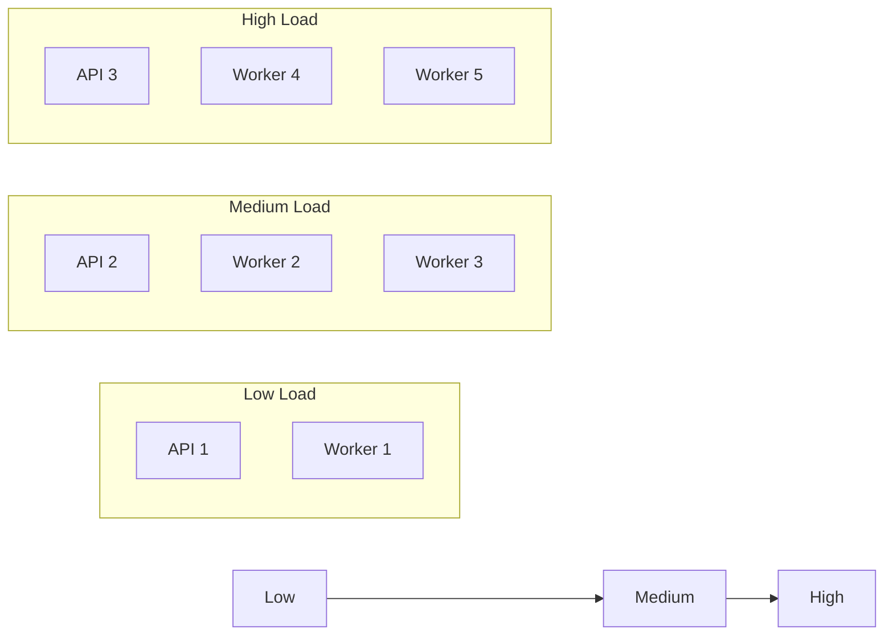
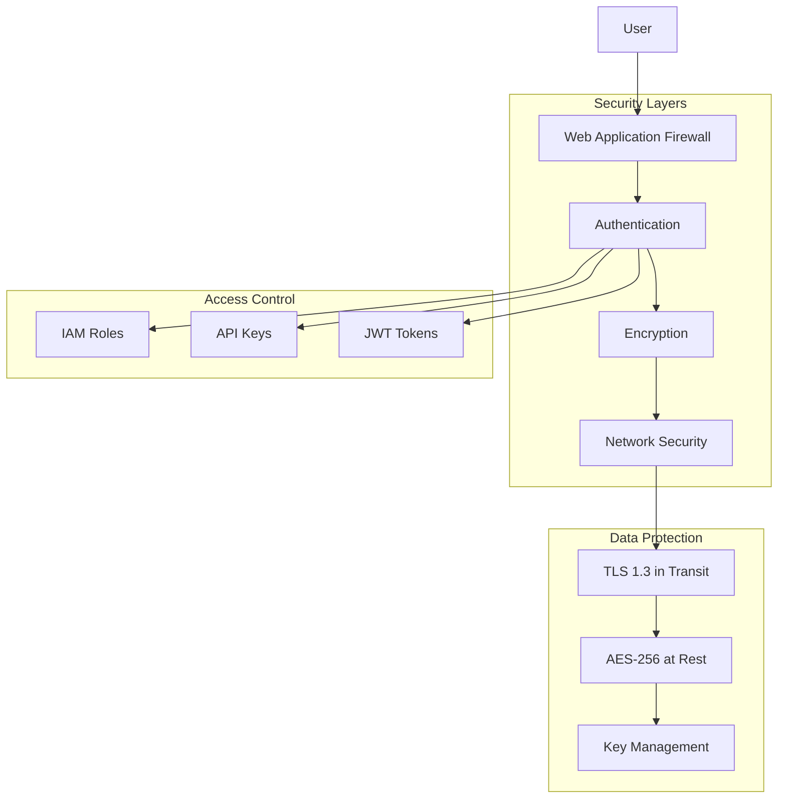
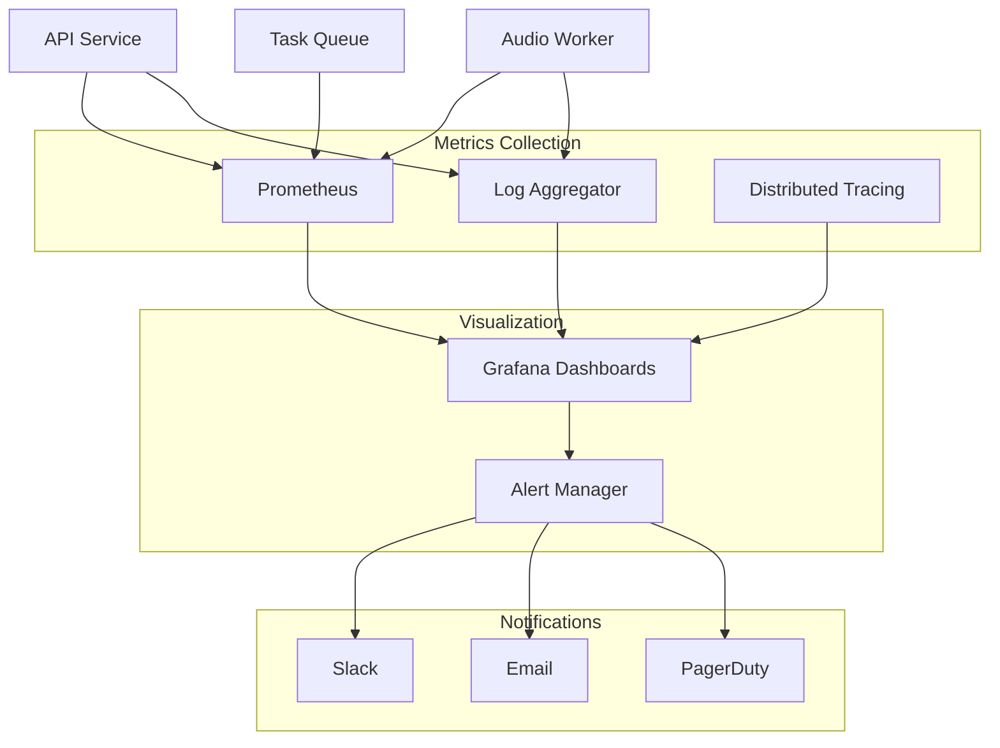

# Moodify Deployment Architecture

This document describes the deployment architecture for Moodify AI Audio Infrastructure.

## System Architecture

## Data Flow

### Audio Analysis Flow

### Audio Processing Flow

## Component Details

### API Service

**Responsibilities**:
- Receive HTTP requests
- Authenticate users
- Validate inputs
- Queue tasks
- Return results

**Scaling**: Horizontal (2-20 instances)

**Endpoints**:
- `/health` - Health check
- `/api/v1/analyze` - Audio analysis
- `/api/v1/process` - Audio processing
- `/api/v1/cases/{id}` - Case status

### Task Queue

**Responsibilities**:
- Decouple API from workers
- Ensure task durability
- Enable retry logic
- Support priorities

**Options**: Redis, RabbitMQ, SQS

**Queues**:
- `audio:analysis` - High priority
- `audio:processing` - Normal priority
- `audio:batch` - Low priority

### Audio Worker

**Responsibilities**:
- Poll queue for tasks
- Process audio files
- Call MRS/Ear/DSP engines
- Store results

**Scaling**: Horizontal (2-50 instances)

**Instance Types**:
- Standard: 4 CPU, 8GB RAM
- GPU: 8 CPU, 32GB RAM, NVIDIA T4

### MRS Engine

**Responsibilities**:
- Moodify Reconstruction Score
- Audio quality assessment
- Feature extraction

**Input**: Audio file
**Output**: MRS scores and features

### Ear Engine

**Responsibilities**:
- Auditory analysis
- Temporal texture analysis
- Multi-scale representation

**Input**: Audio file
**Output**: Auditory features

### DSP Engine

**Responsibilities**:
- Audio processing
- Effects application
- Format conversion

**Input**: Audio file + parameters
**Output**: Processed audio

## Network Architecture

## Deployment Patterns

### Single Region

### Multi-Region (Future)

## Scaling Strategy

### Horizontal Scaling

### Auto-scaling Triggers

| Metric | Scale Up | Scale Down |
|--------|----------|------------|
| API CPU | > 70% | < 30% |
| API Latency | > 500ms | < 200ms |
| Queue Depth | > 100 | < 10 |
| Worker Utilization | > 80% | < 40% |

## Security Architecture

## Monitoring Architecture

## Technology Stack

| Layer | Technology | Alternatives |
|-------|------------|--------------|
| Container | Docker | containerd |
| Orchestration | Docker Compose | Kubernetes |
| API Framework | FastAPI | Flask, Django |
| Queue | Redis | RabbitMQ, SQS |
| Database | PostgreSQL | MySQL, RDS |
| Storage | MinIO | S3, OSS, COS |
| Monitoring | Prometheus | Datadog, CloudWatch |
| Visualization | Grafana | Kibana, CloudWatch |
| Load Balancer | Nginx | Traefik, ALB |

## References

- [Docker Compose Documentation](https://docs.docker.com/compose/)
- [Kubernetes Documentation](https://kubernetes.io/docs/)
- [FastAPI Deployment](https://fastapi.tiangolo.com/deployment/)
- [AWS Well-Architected](https://aws.amazon.com/architecture/well-architected/)
